# tracker-ecs-project

A full-stack task and project tracker built as a DevOps capstone project.

The project demonstrates containerization, AWS networking, ECS Fargate, PostgreSQL, Application Load Balancing, Terraform Infrastructure as Code, GitHub Actions CI/CD, security scanning, secrets management, and immutable container deployments.

The AWS environment has been deployed and verified, including live registration and login testing against the production domain. Because the infrastructure can be destroyed to control costs, check the current AWS state rather than assuming the environment is running.

## What is this application?

The project is a task and project management application with a vanilla HTML/CSS/JavaScript frontend, a Node.js/Express backend API, and a PostgreSQL database.

The application supports:

- User authentication (register/login/logout)
- JWT-based stateless authentication
- bcrypt password hashing
- Task creation, editing, and deletion
- Task priorities (Low / Medium / High)
- Categories (Backend, Frontend, Database, AWS, Networking, Docker, Terraform, CI/CD, General)
- Task descriptions, edited via a modal dialog
- Task status management (Todo / In Progress / Done)
- Kanban board view with drag-and-drop
- Sortable list/table view
- Search and filtering
- Pagination
- Statistics and a completion progress bar
- Dark mode
- Due dates, with overdue and due-soon highlighting

The application itself is intentionally straightforward. The main purpose of the project is to demonstrate how a full-stack application can be containerized, deployed, secured, monitored, and managed using modern DevOps practices.

## Tech stack

| Area                   | Technology                                  |
| ---------------------- | ------------------------------------------- |
| Frontend               | Vanilla HTML / CSS / JavaScript, SortableJS |
| Backend                | Node.js / Express API                       |
| Database               | PostgreSQL 16                               |
| Containerization       | Docker / Docker Compose                     |
| Container registry     | Amazon ECR                                  |
| Container platform     | Amazon ECS Fargate                          |
| Load balancing         | Application Load Balancer                   |
| Database hosting       | Amazon RDS for PostgreSQL                   |
| Infrastructure as Code | Terraform                                   |
| CI/CD                  | GitHub Actions                              |
| AWS authentication     | GitHub OIDC                                 |
| Secrets                | AWS Secrets Manager                         |
| DNS / Edge             | Cloudflare                                  |
| TLS                    | ACM (validated via Cloudflare DNS records)  |
| Security scanning      | TFLint / tfsec                              |

## Architecture

The deployed AWS architecture follows a public-edge/private-application design.

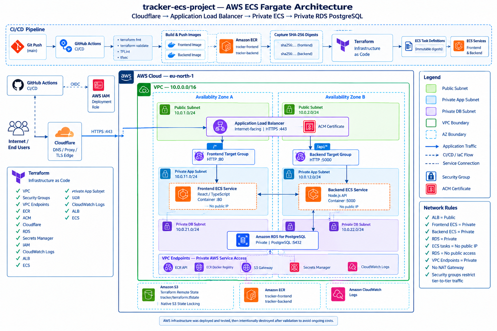

The important networking boundary is:

- The ALB is internet-facing and runs in public subnets.
- Frontend ECS tasks run in private application subnets.
- Backend ECS tasks run in private application subnets.
- RDS PostgreSQL runs in private database subnets.
- ECS tasks do not receive public IP addresses.
- Security groups restrict traffic between the ALB, ECS services, and database.
- VPC endpoints provide private access to required AWS services.
- No NAT Gateway is required for the application's AWS service access pattern.

The deployed VPC uses two Availability Zones across the public, application, and database subnet layers.

## Demo

[Watch the ECS project demo](videos/ecs-project.wmv)

## Request routing

The ALB provides the public entry point for the application.

Traffic is routed according to the configured path rules:

```text
https://<domain>/api/*  -> Backend ECS service
https://<domain>/*      -> Frontend ECS service
```

This keeps the backend tasks private while allowing the frontend and API to share the same public application entry point.

Cloudflare is used for DNS and edge configuration, while the AWS ALB handles HTTPS termination and application traffic into the VPC.

## AWS infrastructure

### VPC

The Terraform configuration creates a dedicated VPC with separate subnet layers:

```text
VPC

- Public subnets
  - Application Load Balancer

- Private application subnets
  - Frontend ECS
  - Backend ECS

- Private database subnets
  - RDS PostgreSQL
```

The private application and database route tables do not carry a
default internet route.

VPC Endpoints

The VPC uses endpoints for AWS services required by private resources, including:

- Amazon ECR API
- Amazon ECR Docker Registry
- Amazon S3
- AWS Secrets Manager
- CloudWatch Logs

This allows private ECS resources to communicate with required AWS services without introducing a NAT Gateway. This was an intentional cost and architecture decision.

### ECS Fargate

The application runs on Amazon ECS using Fargate, with separate services for the frontend and backend.

The ECS tasks:

- Run in private application subnets
- Do not use public IP addresses
- Pull container images from ECR
- Send container logs to CloudWatch Logs
- Use security groups to control network access
- Receive application configuration through environment variables and Secrets Manager secrets

### Application Load Balancer

The ALB is the public entry point into the VPC. The Terraform configuration provides:

- Internet-facing ALB
- HTTPS listener
- HTTP-to-HTTPS redirection
- Frontend target group
- Backend target group
- Path-based routing
- Security-group controlled access to ECS tasks

### RDS PostgreSQL

PostgreSQL is hosted using Amazon RDS. The database:

- Runs in private database subnets
- Is not publicly accessible
- Uses a dedicated DB subnet group
- Uses security-group controlled access
- Uses encrypted storage
- Uses an AWS-managed master password stored in Secrets Manager
- Is separated from the ECS application tier through the VPC network design

The application connects to PostgreSQL over the private VPC network.

### ECR

Amazon ECR stores the frontend and backend container images in two separate repositories: `tracker-frontend` and `tracker-backend`.

The deployment process uses immutable image digests rather than relying on a mutable `latest` tag for ECS deployments. This means an ECS task definition references the exact container image that was built and published by CI/CD.

## Terraform

The infrastructure is defined as code under `terraform/`.

The Terraform project is modular and separates infrastructure responsibilities into reusable components, covering:

- VPC networking
- Security groups
- VPC endpoints
- ECR
- ACM
- Cloudflare (DNS validation and application DNS records)
- RDS
- Secrets Manager
- IAM (including GitHub OIDC federation)
- CloudWatch Logs
- ALB
- ECS

The exact implementation and module configuration are defined in the Terraform source files and should be treated as the source of truth.

## Terraform remote state

Terraform state is stored remotely in Amazon S3. The repository separates the Terraform backend bootstrap from the main application infrastructure:

```text
bootstrap/
    Terraform backend infrastructure

terraform/
    Main AWS application infrastructure
```

The bootstrap configuration creates and configures the S3 bucket used for Terraform state. The main Terraform configuration uses a separate state key (`tracker/terraform.tfstate`) within that same backend, while the bootstrap state lives under `bootstrap/terraform.tfstate`.

The state bucket uses security-focused configuration including:

- Versioning
- Public access blocking
- Bucket-owner-enforced object ownership
- Server-side encryption
- TLS-only access (deny policy on insecure transport)
- Native S3 state locking (`use_lockfile = true`)

`bootstrap/README.md` contains the specific bootstrap and state migration instructions.

## CI/CD

GitHub Actions manages the application and infrastructure workflows:

```text
.github/workflows/
├── application.yml
├── terraform.yml
├── terraform-plan.yml
└── terraform-destroy.yml
```

### Application workflow

Builds the frontend and backend images, pushes both to Amazon ECR, captures the SHA-256 digest for each image, and passes those digests to the Terraform deployment workflow.

### Immutable deployments

```text
Docker image
     |
     v
ECR
     |
     v
SHA-256 image digest
     |
     v
Terraform
     |
     v
ECS task definition
```

This makes deployments reproducible and ensures that ECS references the exact image produced by CI.

### Terraform plan workflow

Runs on pull requests that change Terraform configuration:

- Terraform formatting check
- Terraform init
- Terraform validate
- TFLint
- tfsec (minimum severity HIGH)
- Terraform plan (dry run)

### Terraform apply workflow

Applies the infrastructure configuration using the image digests passed in from the application workflow. When the image digest changes, Terraform creates a new ECS task-definition revision.

### Terraform destroy workflow

Manually triggered only, and requires typing an explicit confirmation value before running an additional safeguard against accidental destruction of the AWS environment.

## AWS authentication

GitHub Actions uses AWS OIDC authentication rather than storing long-lived AWS access keys in GitHub secrets:

```text
GitHub Actions
      |
      | OIDC token
      v
AWS IAM
      |
      v
Deployment role
      |
      v
AWS resources
```

The IAM trust policy restricts which GitHub repository and branch can assume the deployment role, removing the need to maintain permanent AWS access keys for CI/CD.

## Security

### Network security

- ALB is the public entry point
- ECS tasks run in private subnets with no public IP addresses
- RDS runs in private database subnets and is not publicly accessible
- Security groups restrict traffic between tiers
- Private route tables avoid unnecessary internet access

### Secrets

Application secrets are not committed to the repository. AWS Secrets Manager holds the JWT signing secret, while the RDS master password is managed by AWS through Secrets Manager rather than being stored in Terraform configuration or `.tfvars` files.

### Container images

Deployments use immutable image digests so that an ECS deployment is tied to a specific, known image rather than a mutable tag.

### CI/CD security

GitHub Actions uses OIDC authentication for AWS access. Terraform security checks (`terraform fmt -check`, `terraform validate`, `tflint`, and `tfsec` at minimum severity HIGH) run as part of pull requests that modify Terraform code.

Where the Terraform code contains a deliberate `tfsec` ignore, the reason is documented inline in the surrounding Terraform configuration rather than being an unexplained bypass.

## Project structure

```text
tracker-ecs-project/
├── .github/
│   └── workflows/
├── backend/
├── frontend/
├── migrations/
├── bootstrap/
├── terraform/
├── docker-compose.yml
└── README.md
```

| Directory            | Purpose                                    |
| -------------------- | ------------------------------------------ |
| `frontend/`          | Frontend application (vanilla HTML/CSS/JS) |
| `backend/`           | Backend API                                |
| `migrations/`        | PostgreSQL database migrations             |
| `bootstrap/`         | Terraform backend bootstrap                |
| `terraform/`         | Main AWS infrastructure                    |
| `.github/workflows/` | CI/CD workflows                            |

## Local development

Start the local environment with:

```bash
docker compose up --build
```

Docker Compose provides the local application services: frontend, backend API, and PostgreSQL. Exact ports, environment variables, volumes, and service configuration are defined in `docker-compose.yml`.

## Deployment lifecycle

```text
1. Bootstrap Terraform state
          |
          v
2. Deploy AWS infrastructure
          |
          v
3. Build application images
          |
          v
4. Push images to ECR
          |
          v
5. Capture immutable image digests
          |
          v
6. Deploy ECS services with Terraform
          |
          v
7. Validate the application
          |
          v
8. Destroy infrastructure when testing is complete
```

## Cost considerations

Cost control was an important part of the infrastructure design:

- No NAT Gateway — VPC endpoints are used instead for required AWS service connectivity from private resources
- ECS Fargate compute cost, billed per running task
- Application Load Balancer hourly and LCU costs
- RDS instance cost (`db.t3.micro`, single-AZ)
- ECR storage
- CloudWatch Logs
- VPC endpoint costs (interface endpoints bill hourly; the S3 gateway endpoint is free)

Because this is a learning and portfolio project, the `terraform-destroy` GitHub Actions workflow provides a controlled, confirmation-gated way to remove the main infrastructure whenever it is not actively needed, helping avoid unnecessary ongoing costs.

## Screenshots

Project evidence is organized under:

```text
tracker-ecs-project/
├── screenshots/
│   ├── application/
│   ├── docker/
│   ├── aws/
│   └── cicd/
│
└── videos/
    └── ecs-project.wmv
```

The folders contain screenshots captured during development, deployment, testing, and troubleshooting.

### Application

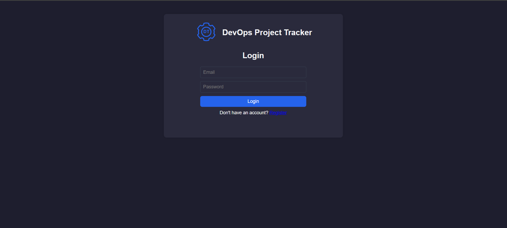

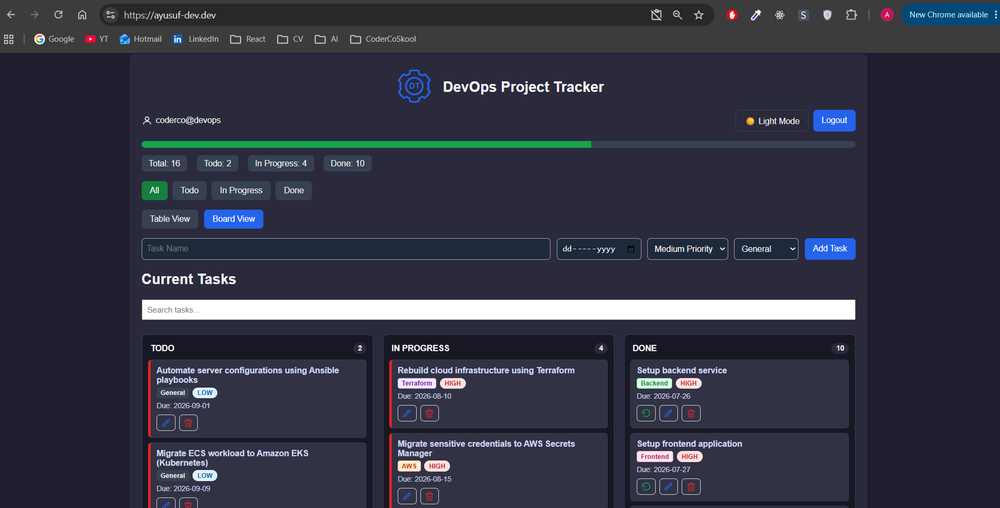

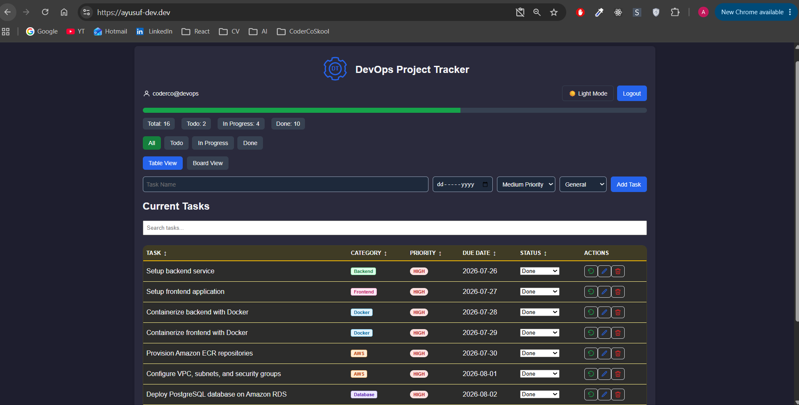

### Docker

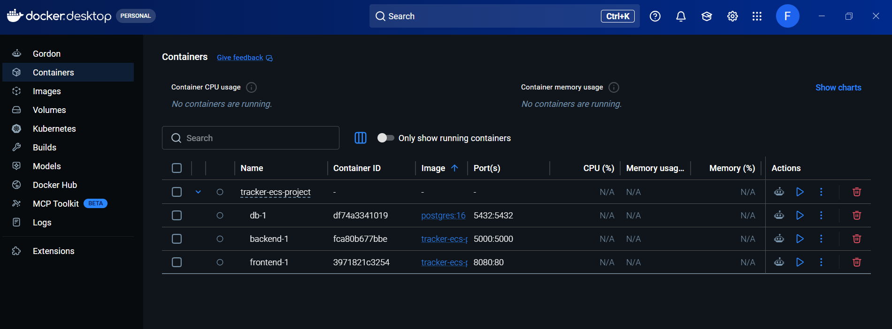

### AWS

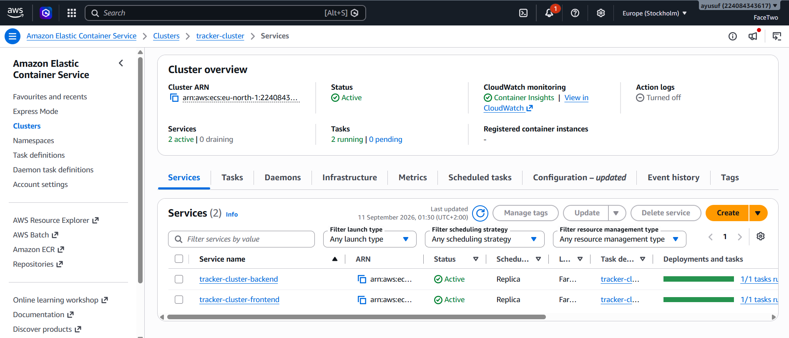

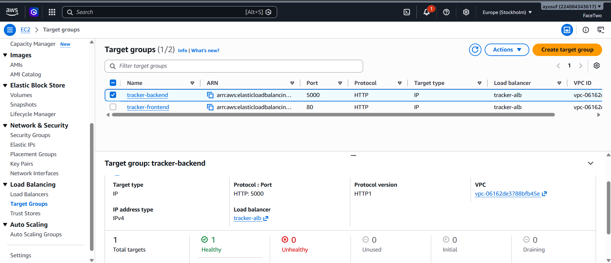

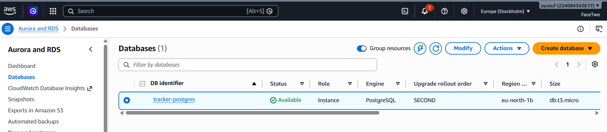

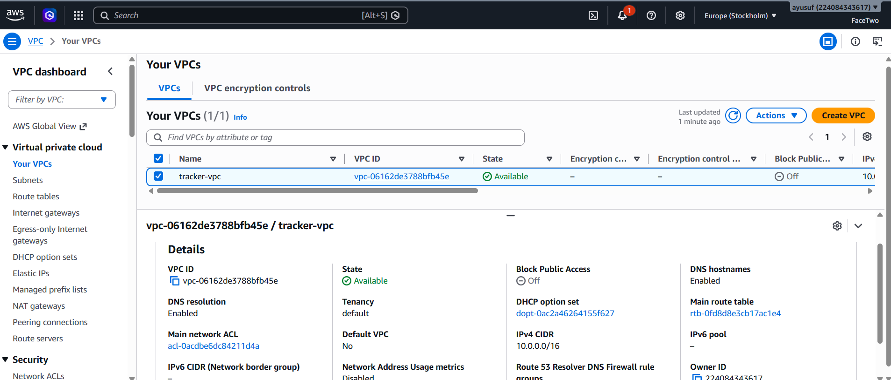

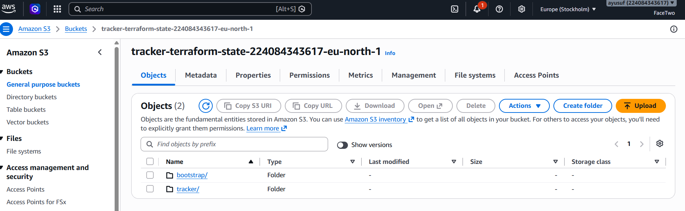

### CI/CD

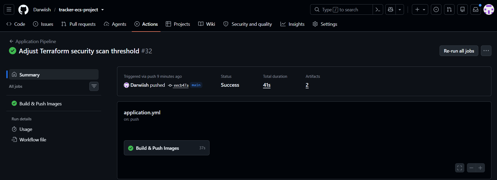

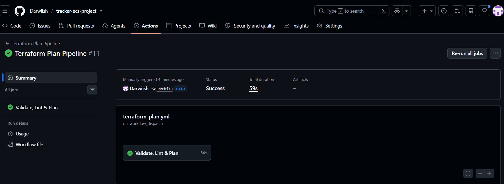

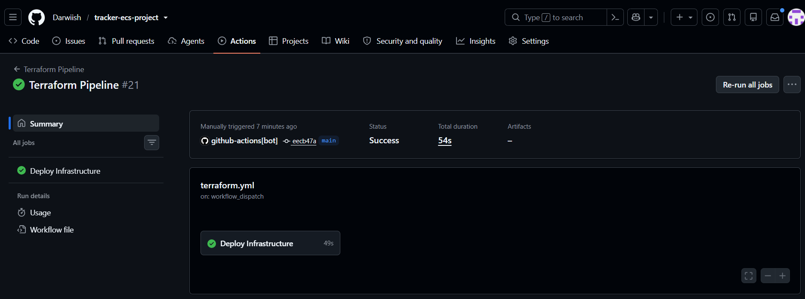

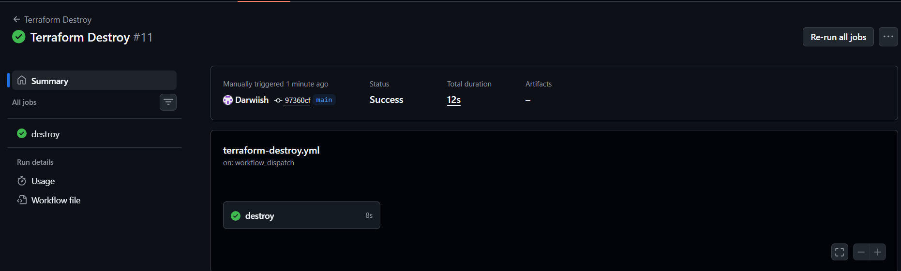

AWS screenshots represent the environment during deployment and testing. They should not be interpreted as proof that the AWS environment is currently running.

## Key design decisions

**PostgreSQL** — used both locally and in the AWS deployment.

**ECS Fargate** — removes the need to manage EC2 instances for the container workloads.

**Private ECS tasks** — frontend and backend ECS tasks run without public IP addresses; the ALB provides the public entry point while the application workloads stay inside private subnets.

**Private RDS** — the database is isolated in private database subnets and is reachable only from the application tier through security-group rules.

**VPC endpoints instead of NAT Gateway** — provides the AWS service connectivity required by the private application tier without the ongoing cost of a NAT Gateway.

**Terraform** — makes the AWS environment reproducible rather than dependent on manual AWS Console configuration.

**GitHub OIDC** — removes the need for long-lived AWS credentials in GitHub Actions.

**Immutable image deployment** — image digests provide a deterministic reference to the exact container image deployed to ECS.

**Cloudflare** — provides the DNS and edge layer in front of the AWS ALB; Route 53 is not used in this architecture.

## What I learned

This project provided practical experience with Linux, Git and GitHub, Docker, Docker Compose, Node.js, PostgreSQL, AWS VPC networking, public and private subnets, route tables, security groups, VPC endpoints, ECS Fargate, Application Load Balancer, Amazon ECR, immutable container images, Amazon RDS, AWS Secrets Manager, CloudWatch Logs, AWS Certificate Manager, Cloudflare, IAM, GitHub Actions, GitHub OIDC, Terraform, Terraform remote state, TFLint, tfsec, infrastructure deployment and destruction, private AWS networking troubleshooting, and cost-aware AWS architecture design.

The project also reinforced the importance of validating infrastructure behavior directly by testing live endpoints and checking ECS task and service status rather than assuming that a successful `terraform apply` alone means the application is working correctly.
